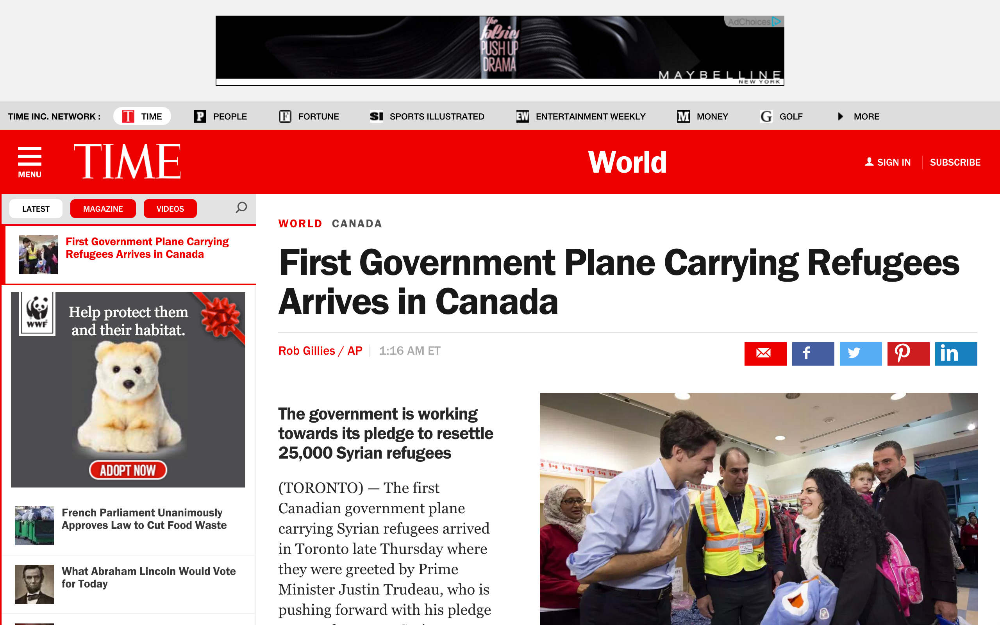
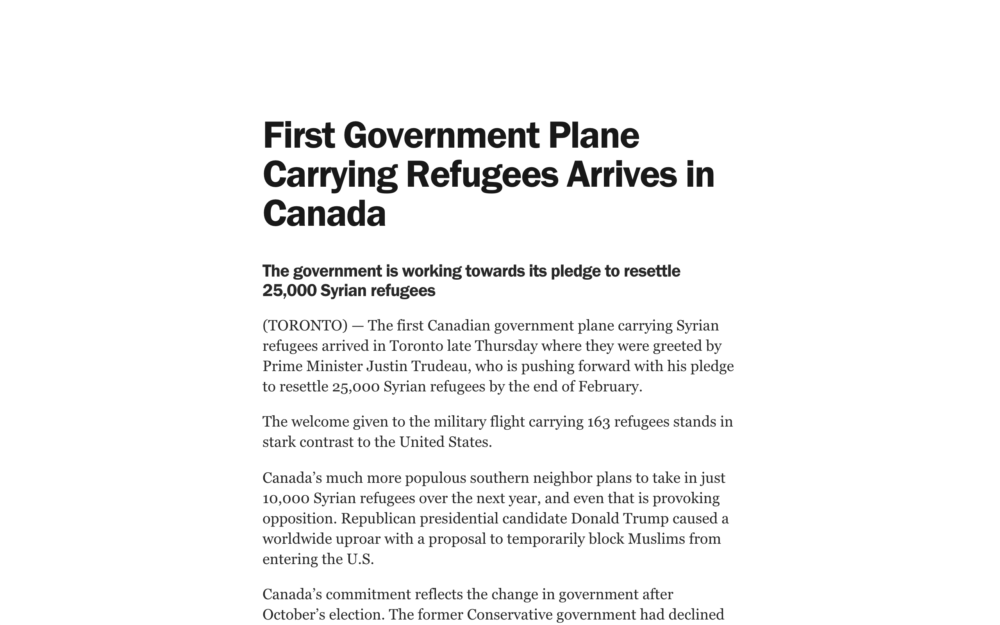

---
## Some websites have a lot of shit on them.
boom! is a browser extension that lets you declutter busy pages and make them readable again.

**Before:**

**After:**

## Some websites won't let you use them without creating an account.
boom! lets you knock down annoying paywalls.

## Sound cool?
Get it on [Firefox](https://addons.mozilla.org/addon/boom-readability/) or [Chrome](https://goo.gl/Jjyid5).

## Usage
Click the bomb icon. The fuse should light. At this point, you can:

- Click elements to delete them.
- Hold **shift** and click text elements to make them more readable.

Hitting **escape** or clicking the bomb icon again defuses the extension.

You can toggle boom! with a hotkey by going to Tools -> Extensions and clicking the "Keyboard shortcuts" link at the bottom.

:bomb::bomb::bomb:

## Licenses
### Logo
Bomb by icon 54 from the Noun Project, Creative Commons 3.0

### Everything else
[MIT](./LICENSE.md)
